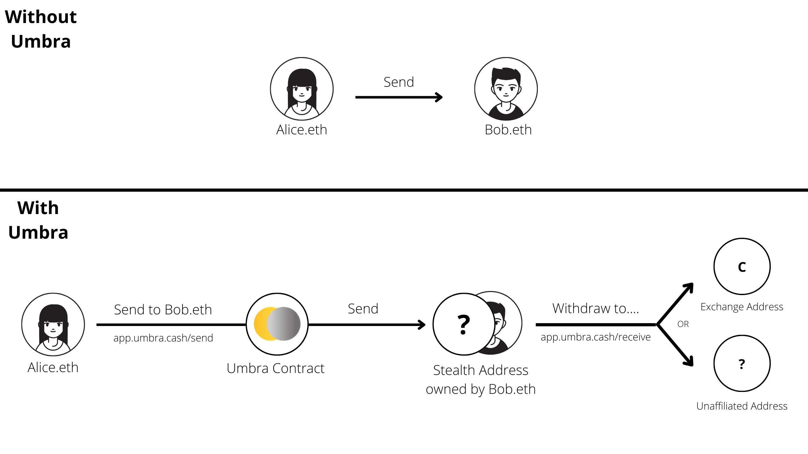

<div align="center">
	
	<br />
	<br />
</div>

<p align="center">
	<b>Privacy Preserving Stealth Payments for EVM Blockchain Networks.</b>
</p>

<p align="center">
	🚀 <a href="https://app.umbra.cash">app.umbra.cash</a>
	🐦 <a href="https://twitter.com/umbracash">@UmbraCash</a>
	💬 <a href="https://discord.com/invite/uw4y5J2p7C">Discord</a>
	🤑 <a href="https://explorer.gitcoin.co/#/round/1/0x12bb5bbbfe596dbc489d209299b8302c3300fa40/0x12bb5bbbfe596dbc489d209299b8302c3300fa40-22">Gitcoin</a>
	🏗️ <a href="https://twitter.com/scopelift">@ScopeLift</a>
</p>

<div align="center">
	
	<br />
</div>

## About

Umbra is a protocol for stealth payments on EVM blockchain networks. It enables privacy preserving transactions where **the receiver's identity is only known to the sender and receiver**.

<div align="center">
	<br />
	
</div>

### FAQ

#### What is Umbra?

Umbra is a stealth address protocol for EVM networks. That means it allows a payer to send funds to a fresh address. That address is controlled by the intended receiver, but only the payer and the receiver know that.

One way to think of Umbra is this: before anyone sent you funds, you sent them a brand new, never before used address. Only the sender would know you control that address, which adds a layer of privacy to your payment. Payments via Umbra work similarly, but are non-interactive—you don’t need to give someone a fresh address, the sender can just generate one they know only you will be able to access.

#### Can you walk me through an example?

Alice owns a business and hires Bob to subcontract for her. She agrees to pay Bob 1,000 Dai/week for his work. Bob owns the ENS address bob.eth. If Alice sent the funds each week to bob.eth, anyone looking at the chain could trivially know that Alice is paying Bob 1,000 Dai each week.

Instead, Bob and Alice will use Umbra for private payments. The first time Bob visits the Umbra app, he sets up his account, enabling anyone to privately pay him via Umbra using the name bob.eth, or his normal Ethereum address. Alice then uses Umbra to send 1,000 Dai to Bob each week— she only needs to know his ENS name.

On chain, we see Alice pays 1,000 Dai to a new empty address each week. Behind the scenes, Bob controls the keys to each of these addresses via Umbra, but nobody except Alice and Bob knows this.

Bob uses Umbra to withdraw his 1,000 Dai each week. He only needs to provide an address to send it to. It’s best for him to use an address that’s not tied to his identity. He usually chooses to send it straight to an exchange, where he sells it for fiat as needed. Importantly, this means **Bob's exchange now knows this payment went to him**. To the casual chain observer— one without access to proprietary centralized exchange data— the fact that Alice's payment went to Bob is obscured.

Consider another example: Liza runs a website that asks for donations. If everyone donated by directly sending her funds, everyone would know how much Liza received in donations. If donations were sent with Umbra instead, each donation would be sent to a different address, and only Liza would know the total amount of donations she received.

#### How does it work?

1. When setting up your Umbra account, users sign a message. The hash of this message is used to generate two private keys—a "spending key" and a "viewing key".
2. The corresponding public keys are both published on-chain as records associated with your address.
3. A payer uses your address, ENS, or CNS name to look up your two public keys. Separately, the payer generates a random number.
4. The random number is used with the spending public key to generate a "stealth address" to send funds to. The viewing public key is used to encrypt the random number.
5. Using the Umbra contract, the payer sends funds to the stealth address and the stealth address and encrypted random number are emitted as an Announcement event.
6. The receiver scans all Announcement events from the Umbra contract. For each, they use their viewing private key to decrypt the random number, then multiply that number by their spending private key to generate the stealth private key. If the stealth private key controls the stealth address emitted in the Announcement, this payment was for the receiver
7. The receiver can now use the spending private key to either directly send the transaction required to withdraw funds to another address, or sign a meta-transaction to have the withdrawal request processed by a relayer.

See the [Technical Details: How does it work?](https://app.umbra.cash/faq#how-does-it-work-technical) for more details.

#### How private is Umbra?

Umbra offers a limited set of privacy guarantees and it’s important to understand them before using the protocol. Umbra does not offer "full" privacy like Aztec or Zcash. It simply makes it impossible for any outside observers (i.e. anyone who is not the sender or the receiver) to know who the sender paid by looking at the receiving address.

It’s important to understand that poor hygiene by the receiver— for example, sending the funds directly to a publicly known address— reduces the privacy benefits for both the sender and receiver.

The privacy properties of Umbra can also be diminished if an observer can narrow down the set of potential recipients for a given transaction. Any valid public key can be used as a recipient, and anyone who has sent a transaction on Ethereum has a publicly available public key. Therefore, by default, the "anonymity set"—the set of potential recipients of a transaction—is anyone who has ever sent an Ethereum transaction!

In practice this isn’t necessarily the case, and an observer may be able to narrow down the list of recipients in a few ways:

1. Most users will use ENS names to send funds, so the recipient most likely has published keys under an ENS name
2. Poor hygiene when withdrawing funds from your stealth addresses can reduce or entirely remove the privacy properties provided by Umbra. See [Which addresses are safe for withdrawing funds?](https://app.umbra.cash/faq#what-addresses-are-safe-for-withdrawing-funds-to) for more details. Always use caution when withdrawing!

#### Is Umbra a mixer?

No. Umbra is not a mixer and does not use zero knowledge proofs. Instead, Umbra is based on ordinary elliptic curve cryptography. It’s meant for payments between two entities, and comes with a different set of privacy tradeoffs. Rather than breaking the link between sending and receiving address, like a mixer, Umbra makes that link meaningless. Everyone can see who sent the funds, and everyone can see the address funds were sent to, but that receiving address has never been seen on-chain so it’s impossible for any outside observers to know who controls it.

#### Where can I learn more?

Check out the [full FAQ](https://app.umbra.cash/faq) to get more details about Umbra.

## Development

This repository uses [yarn](https://yarnpkg.com/) for package management and [volta](https://volta.sh/) for dev tool version management. Both are prerequisites for setting up your development environment. The repository also requires [foundry](https://github.com/gakonst/foundry) for development of periphery smart contracts.

### Components

Umbra is a monorepo consisting of 4 packages:

* [frontend](frontend/) — Frontend web3 app for setting up and using Umbra, deployed at [app.umbra.cash](https://app.umbra.cash)
* [contracts-core](contracts-core/) — Solidity contracts used in the Umbra Protocol.
* [contracts-periphery](contracts-periphery/) — Solidity contracts used by the Umbra frontend to add features and improve UX.
* [umbra-js](umbra-js/) — A TypeScript library for building Umbra-enabled web3 apps in node.js or in the browser.

The monorepo structure simplifies the development workflow.

### Instructions

To get started, clone this repo, then follow these instructions:

```sh
# run these commands from workspace root!
cp contracts-core/.env.example contracts-core/.env # please edit the .env with your own environment variable values
cp frontend/.env.example frontend/.env # please edit the .env with your own environment variable values
cp umbra-js/.env.example umbra-js/.env # please edit the .env with your own environment variable values
curl -L https://foundry.paradigm.xyz | bash # install foundryup binary
foundryup # install Foundry
yarn install # installs dependencies for each of the 3 packages. Also builds umbra-js.
yarn test # runs the test suite for each package

# Additional commands also available from the workspace root:
yarn build # builds each of the 3 packages
yarn clean # removes build artifacts for each of the 3 packages
yarn lint # lints each of the 3 packages
yarn prettier # runs formatting on each of the 3 packages
yarn test # runs tests for each of the 3 packages
```

Note: If you want to be more precise with your command (e.g. just building, cleaning, or testing 1 package), simply run any above command from the package directory. For example, if you were just working on the contract code, you might:

```sh
cd contracts-core # move into the contracts-core sub directory
yarn build # build only the contracts
yarn clean # remove only the contract build artifacts
yarn test # run only the contract tests
```

### Contract Deployments

Umbra contracts are deployed at the same address on each network where Umbra resides. Below is a list of addresses for the contracts currently in use.

|Contract          |Type     |Address|
|------------------|---------|-------|
|Umbra             |Core     |[0xFb2dc580Eed955B528407b4d36FfaFe3da685401](https://blockscan.com/address/0xfb2dc580eed955b528407b4d36ffafe3da685401)|
|StealthKeyRegistry|Core     |[0x31fe56609C65Cd0C510E7125f051D440424D38f3](https://blockscan.com/address/0x31fe56609c65cd0c510e7125f051d440424d38f3)|
|UmbraBatchSend    |Periphery|[0xDbD0f5EBAdA6632Dde7d47713ea200a7C2ff91EB](https://blockscan.com/address/0xDbD0f5EBAdA6632Dde7d47713ea200a7C2ff91EB)|

### Contributions

Contributions to Umbra are welcome! Fork the project, create a new branch from master, and open a PR. Ensure the project can be fast-forward merged by rebasing if necessary.

## License

Umbra is available under the [MIT](LICENSE.txt) license.

Copyright (c) 2023 ScopeLift
